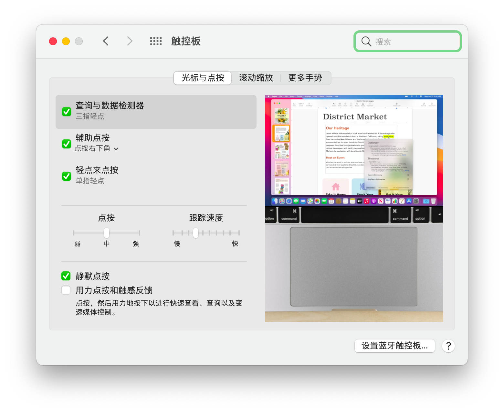

# Dell Inspiron 15-5567 的 OpenCore Config
## 详细配置：
|电脑型号   |Dell Inspiron 15-5567 笔记本|
|  :----:    |  :----:                            |
|处理器|Intel Core i7-7500U @2.70GHz 四核|
|硬盘|Intel SSDSC2KF256H6 SATA 256GB 固态|
|    内存      |           8GB        |
|显卡| Intel(R) HD Grapics 620 和 Radeon (TM) R7 M440 (2 GB)|
|声卡|Realtek ALC256|
|网卡|Intel Dual Band Wireless-AC 3165（无线）和 Realtek 有线网卡（具体型号不明）|
|显示器|1080P（1920\*1080）|
## Config 信息：
Config 修改自 aswindevsp/Dell-Inspiron-5567-BigSur 的 Config。（因此我使用了 fork）

版本：OpenCore Version 0.7.7

所有 kext 都已经使用最新版本（2022.1.17）

可启动的 macOS：macOS Big Sur & macOS Monterey

## 系统运行情况：
### macOS Big Sur：
电源和电量正常

睡眠与唤醒正常，带呼吸灯

核显正常，但独立显卡不支持，已屏蔽

声卡正常，但耳机接口未测试

亮度调节正常

声音调节以及亮度调节的快捷键正常

无线网卡正常，有线网卡没有驱动

USB 接口正常，但 SD 卡接口无法运行

触摸板正常，支持多指手势
### macOS Monterey
电源和电量正常

睡眠与唤醒正常，带呼吸灯

核显正常，但独立显卡不支持，已屏蔽

声卡正常，但耳机接口未测试

亮度调节正常

声音调节以及亮度调节的快捷键正常

无线网卡正常，有线网卡没有驱动

USB 接口正常，但 SD 卡接口无法运行

触摸板正常，支持多指手势
## 注意事项：
这个 Config 必须在 Cfg-Lock 关闭时安装，若要解锁 Cfg-Lock，请阅读[子文档：如何解锁 Cfg-Lock](./subdocument/Unlock_Cfg-Lock.md)

Config 包含了 ACPI 重命名，为了保证功能正常，没有 "ACPI Error" ，建议前往戴尔官网，将 BIOS 升级到1.4.1，以便功能正常。

默认不开启-v 模式，若要开启，请按一下 Win+V 组合键，然后启动 macOS；默认在 OpenCore 主界面里隐藏了选项，请按一下空格来显示所有项目。

macOS 的触摸板设置默认与 Windows 不同。安装过程中**请保持使用点按（用力按下）**，并且在安装完毕之后（已登录），将光标移动至系统偏好设置，双指轻点，然后点按打开。你可以参考下图，使 macOS 的触控板设置更贴近 Windows 的设置。

Config 的三码无效。若要使用 iMessage 等功能，请自行解决。

压缩包内附带修复耳机的文件夹，名称为 "ComboJack_Installer"。解压，修复方法参见这个链接的2、3步：[GitHub – hackintosh-stuff/ComboJack: Hackintosh combojack support for alc256/alc255.](https://github.com/hackintosh-stuff/ComboJack)

SD 卡接口可能可以运行，但本人没有进行试验。可以访问[GitHub – cholonam/Sinetek-rtsx: macOS driver for Realtek SD card readers.](https://github.com/cholonam/Sinetek-rtsx)进行尝试。

开启 Cfg-Lock 并非一劳永逸，当：

重置 NVRAM；

更新 BIOS；

在 BIOS 设置界面恢复了默认设置，

的时候，Cfg-Lock 将重新关闭。您需要重新按照步骤开启。

另外，建议将 DVMT 调整到 64M 以开启完美外屏4K，这里不详细介绍，请自行查找教程。
## 下载：
请前往 Releases 页面。
## 另：
本人已经对 Hackintosh 不感兴趣，如果你有一定技术，且有长期使用 Hackintosh 的需求，欢迎来接手这个项目！😊
